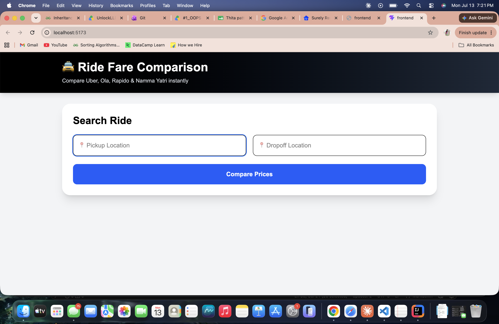
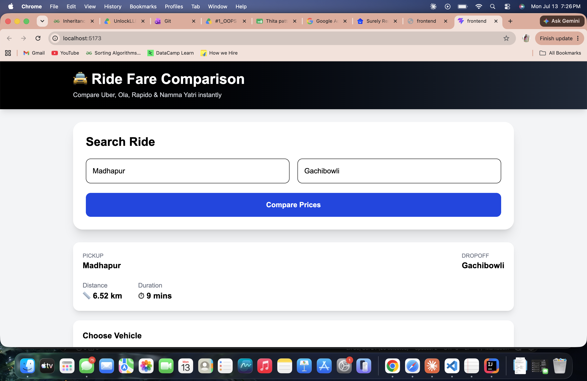
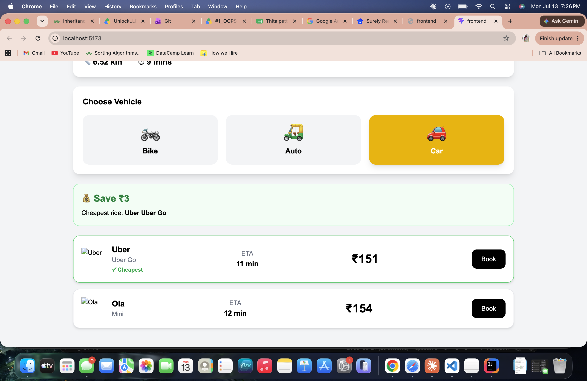
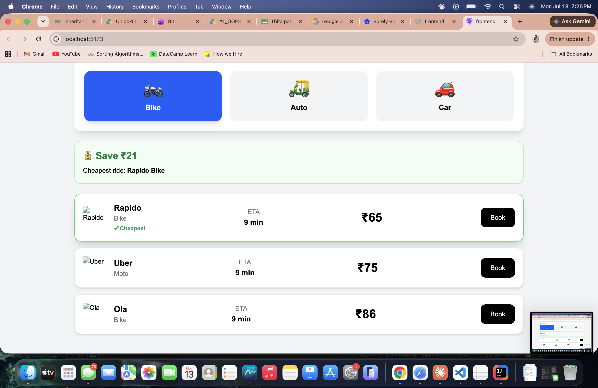
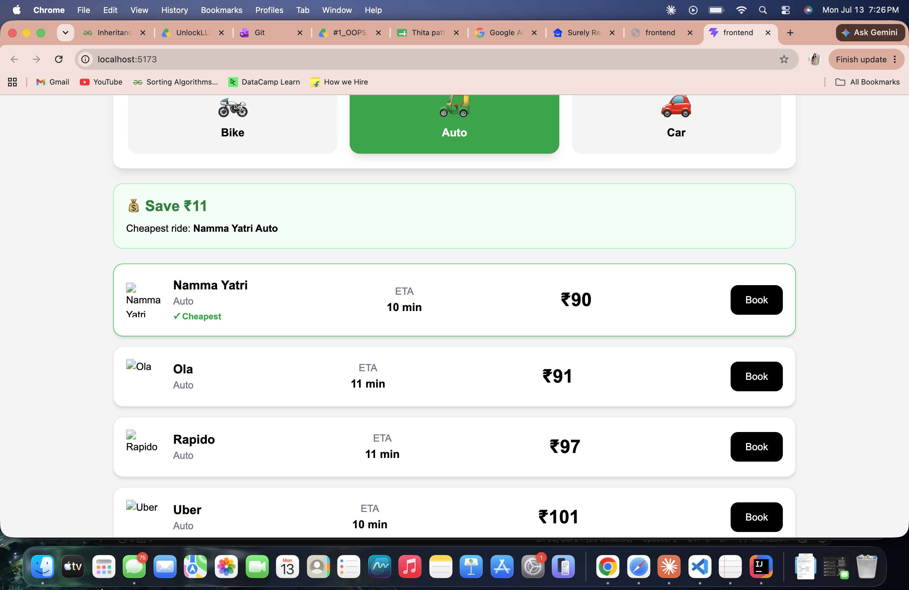

# 🚖 Ride Fare Comparison

A full-stack web application that compares ride fares across multiple ride-hailing platforms including **Uber, Ola, Rapido, and Namma Yatri**. Users can enter pickup and drop-off locations to instantly compare estimated fares, travel distance, duration, and choose the cheapest ride.

---

## 🚀 Live Demo

**Frontend:** https://vercel.com/baratam-gayatris-projects/ride-fare-comparison

**Backend API:** https://ride-fare-comparison.onrender.com

---

# Ride Fare Comparison App

Full-stack application that aggregates fares from multiple ride-sharing providers.

## 📸 Screenshots

### Search Interface

*Users enter pickup and dropoff locations*

### Live Fare Comparison

*Real-time fares from Uber, Ola, and Rapido*

### Price Comparison with Savings



*Cheapest option highlighted with savings calculated*

---

## ✨ Features

- 🔍 Search rides using pickup and drop locations
- 💰 Compare fares across Uber, Ola, Rapido, and Namma Yatri
- 🏆 Highlights the cheapest ride
- 📍 Displays route distance and estimated travel time
- 🚗 Filter rides by Bike, Auto, and Car
- 📱 Responsive and modern UI
- ☁️ Deployed on Vercel and Render

---

## 🛠 Tech Stack

### Frontend

- React.js
- Redux Toolkit
- React Router
- Axios
- Tailwind CSS

### Backend

- Node.js
- Express.js
- MongoDB Atlas
- LocationIQ Geocoding API
- OSRM Routing API

### Deployment

- Vercel (Frontend)
- Render (Backend)

---

## 📂 Project Structure

```
ride-fare-comparison/
│
├── frontend/
│   ├── src/
│   ├── public/
│   └── package.json
│
├── backend/
│   ├── controllers/
│   ├── routes/
│   ├── services/
│   ├── config/
│   ├── models/
│   └── package.json
│
└── README.md
```

---

## ⚙️ Installation

### Clone the repository

```bash
git clone https://github.com/baratamgayatri301295/ride-fare-comparison
```

```bash
cd ride-fare-comparison
```

---

## Backend Setup

```bash
cd backend
npm install
```

Create a `.env` file inside the backend folder:

```env
PORT=5001

MONGODB_URI=YOUR_MONGODB_URI

JWT_SECRET=YOUR_SECRET_KEY

LOCATIONIQ_API_KEY=YOUR_LOCATIONIQ_API_KEY

FRONTEND_URL=http://localhost:5173
```

Run the backend:

```bash
npm run dev
```

---

## Frontend Setup

```bash
cd frontend
npm install
```

Create a `.env` file:

```env
VITE_API_URL=http://localhost:5001
```

Run the frontend:

```bash
npm run dev
```

---

## API Endpoints

### Search Fare

```
POST /api/search
```

Request

```json
{
  "pickup": "Madhapur",
  "dropoff": "Gachibowli"
}
```

Response

```json
{
  "success": true,
  "distance": 6.5,
  "duration": 9,
  "fares": [
    {
      "provider": "Uber",
      "vehicleType": "Uber Go",
      "fare": 152
    }
  ]
}
```

---

## Future Enhancements

- 🗺️ Google Maps integration
- 📍 Live map with route visualization
- 🔐 User authentication
- ❤️ Save favorite locations
- 📜 Ride history
- 🌙 Dark mode
- 💳 Ride booking integration

---

## Learning Outcomes

This project helped me gain hands-on experience with:

- Building REST APIs using Express.js
- State management with Redux Toolkit
- MongoDB Atlas integration
- Third-party API integration
- Full-stack deployment using Render and Vercel
- Environment variable management
- Responsive UI development with Tailwind CSS

---

## Author

**Gayatri Baratam**

GitHub:https://github.com/baratamgayatri301295

LinkedIn:https://www.linkedin.com/in/gayatri-baratam-652974212/

---